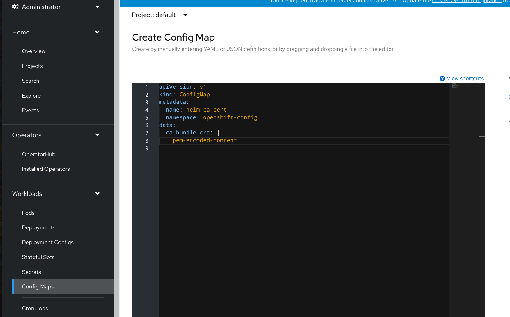
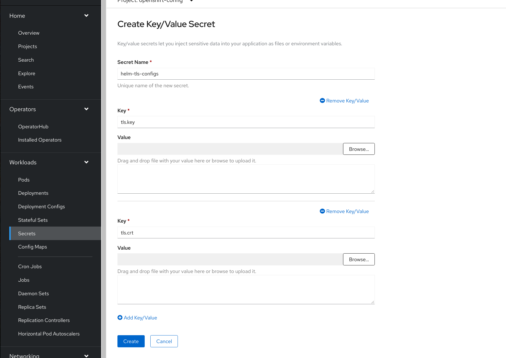

## Configure Access to 3rd Party Chart Repositories in Openshift Console.


### Default Chart Repository

Openshift console by default lists Helm charts from [RedHat Helm chart repository](https://redhat-developer.github.io/redhat-helm-charts/index.yaml).


### Replace Default with 3rd-party Repository

Instances of [`HelmChartRepository` CRD](https://github.com/openshift/api/blob/master/helm/v1beta1/zz_generated.crd-manifests/00_helmchartrepositories.crd.yaml)
capture the details required for accessing a Helm chart repository.


**Basic structure of `HelmChartRepository` CR**
```yaml
apiVersion: helm.openshift.io/v1beta1
kind: HelmChartRepository
metadata:
  name: NAME
spec:
 # optional name that might be used by console
 # name: CHART_DISPLAY_NAME
  connectionConfig:
    url: HELM_CHART_REPO_URL
```


**Add Azure Sample Chart Repository**
```shell script
$ cat <<EOF | kubectl apply -f -
apiVersion: helm.openshift.io/v1beta1
kind: HelmChartRepository
metadata:
  name: azure-sample-repo
spec:
  connectionConfig:
    url: https://raw.githubusercontent.com/Azure-Samples/helm-charts/master/docs
EOF
```

#### Configure CA certificates

If accessing chart repository requires usage of a custom CA certificate, its content (PEM encoded) needs be
stored under key `ca-bundle.crt` within the configmap in `openshift-config` namespace. The configmap name
is referred in `spec.connectionConfig.ca.name` field.

```yaml
spec:
  connectionConfig:
    url: https://my-private-repo.foo.local
    ca:
      name: helm-ca-cert
```


Configmaps can be added through UI:



or from CLI:

```shell script
kubectl create configmap helm-ca-cert \
  --from-file=ca-bundle.crt=/path/to/certs/ca.crt \
  -n openshift-config
```


#### Configure Client TLS Configurations

Similarly, client certificate and key can be provided for cases when the repo requires them.
These should be in pem encoded format and stored under key `tls.crt` and `tls.key` respectively,
within a `secret` in `openshift-config` namespace. The secret name is referred in `spec.connectionConfig.tlsClientConfig.name`
field.

```yaml
spec:
  connectionConfig:
    url: https://my-private-repo.foo.local
    tlsClientConfig:
      name: helm-tls-configs
```

Secrets can be added through UI:



or from CLI:

```shell script
kubectl create secret generic helm-tls-configs \
  --from-file=tls.crt=/path/to/certs/client.crt \
  --from-file=tls.key=/path/to/certs//client.key \
  -n openshift-config
```

### Disable Helm chart repository

We can disable listing helm charts in the catalog by adding `disabled` flag.

```yaml
spec:
  connectionConfig:
    url: https://my-private-repo.foo.local
  disabled: true
```

By adding `disabled` flag in the CR, we are disabling helm chart listing from `https://my-private-repo.foo.local` repository.

### Multiple Chart Repository Support

Adding multiple instances of `HelmChartRepository` is supported. As the result, `/api/helm/charts/index.yaml`
endpoint returns combined chart list, containing charts from all accessible repositories.

### Access Control

When requesting repo index through `/api/helm/charts/index.yaml` endpoint, `HelmChartRepository` CRs and
corresponding configmaps and secrets are read on behalf of logged UI user. By default, only admins have
proper rights. Without that, users see only charts from the default repo. Admins might allow others to
browse configured repo by adding appropriate roles to the cluster.

Example: allow all regular users to browse repos:

```shell script
$ cat <<EOF | kubectl apply -f -
kind: ClusterRole
apiVersion: rbac.authorization.k8s.io/v1
metadata:
  name: helm-chartrepos-viewer
rules:
  - verbs:
      - get
      - list
    apiGroups:
      - helm.openshift.io
    resources:
      - helmchartrepositories
---
kind: ClusterRoleBinding
apiVersion: rbac.authorization.k8s.io/v1
metadata:
  name: helm-chartrepos-view
subjects:
  - kind: Group
    apiGroup: rbac.authorization.k8s.io
    name: 'system:authenticated'
roleRef:
  apiGroup: rbac.authorization.k8s.io
  kind: ClusterRole
  name: helm-chartrepos-viewer
EOF
```

In case when certificates are needed, additional appropriate roles must
be added in `openshift-config` namespace.

Following the previous example, regular users need to
get read access to `helm-ca-cert` configmap and `helm-tls-configs` secret.

```shell script
$ cat << EOF | kubectl apply -f -
apiVersion: rbac.authorization.k8s.io/v1
kind: Role
metadata:
  namespace: openshift-config
  name: helm-chartrepos-tls-conf-viewer
rules:
- apiGroups: [""]
  resources: ["configmaps"]
  resourceNames: ["helm-ca-cert"]
  verbs: ["get"]
- apiGroups: [""]
  resources: ["secrets"]
  resourceNames: ["helm-tls-configs"]
  verbs: ["get"]
---
kind: RoleBinding
apiVersion: rbac.authorization.k8s.io/v1
metadata:
  namespace: openshift-config
  name: helm-chartrepos-tls-conf-viewer
subjects:
  - kind: Group
    apiGroup: rbac.authorization.k8s.io
    name: 'system:authenticated'
roleRef:
  apiGroup: rbac.authorization.k8s.io
  kind: Role
  name: helm-chartrepos-tls-conf-viewer
EOF
```

Applying carefully crafted roles, an admin can really fine tune
access to declared repos, even achieve different views for
appropriate user groups, etc.
